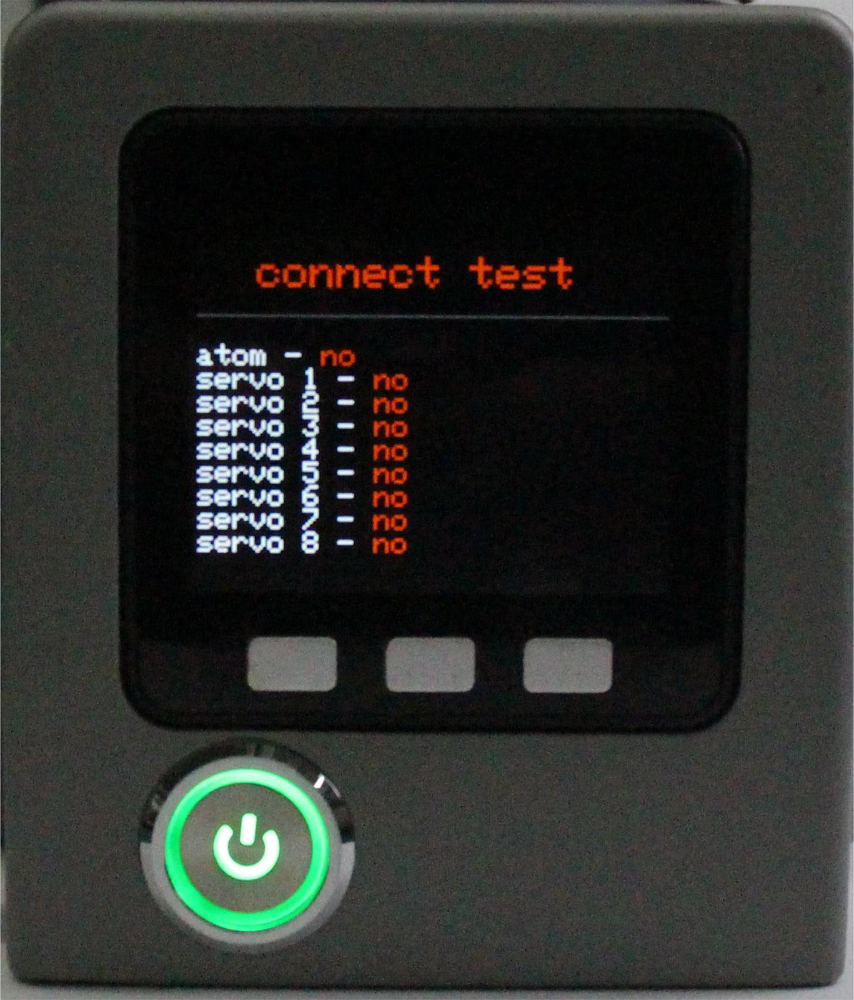

# Status information

This chapter describes how to check the status of a device using basic software. Please make sure that both the software version and firmware version of the device remain unchanged (factory default version) before use. If you make any modifications to the software or firmware, ensure that your operation meets the requirements listed in this chapter.

At present, the information that can be viewed is divided into motor connection status and the built-in firmware version number of the robotic arm.

**Step 1**: Select Information and click OK to enter the status information interface.

**Step 2**: Press the A key to start connection detection. The screen shows the connection status of the Atom and the motor.

**Step 3**: Press the B key to start detecting the version information, and the screen will display the firmware version.

**Step 4**: Press the C key to exit this function.

---

[← Previous page](./5.1.4-transponder.md) | [Next page →](./5.1.6-flash.md)